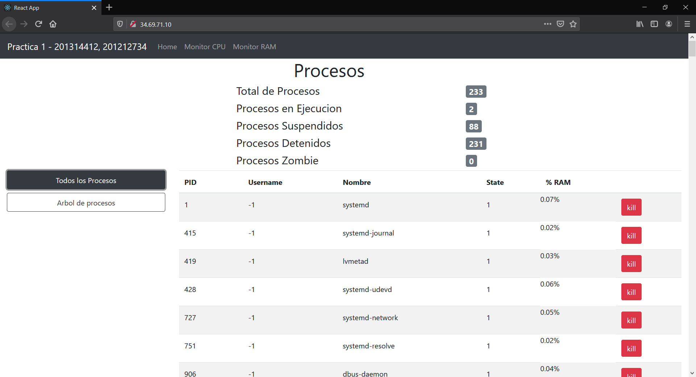
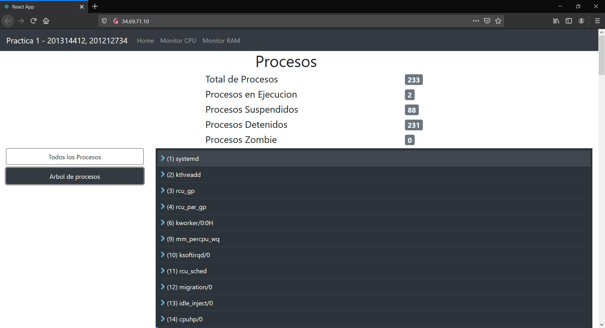
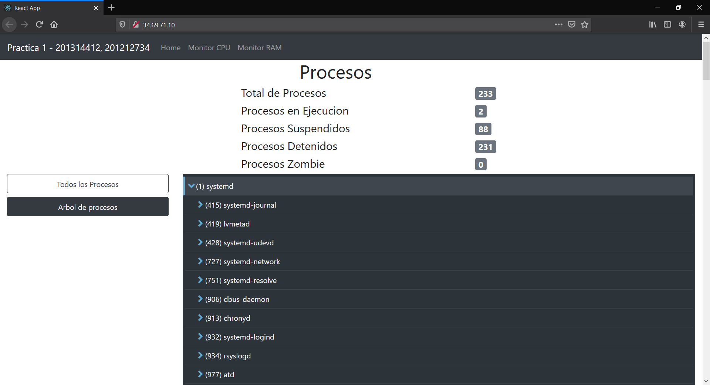
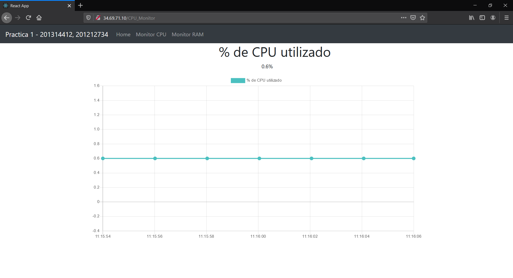
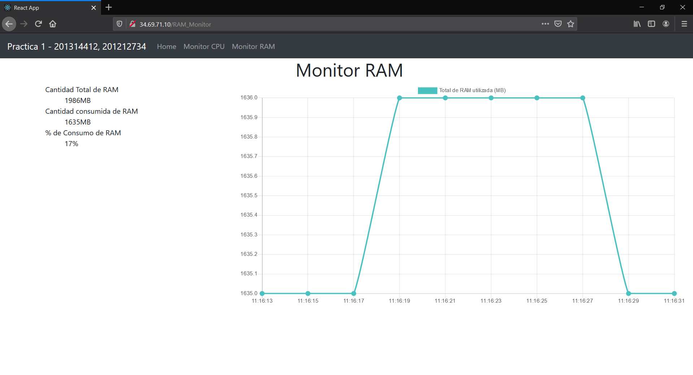

# Manual de Usuario

## Home

### Ruta 

* [http://34.122.126.151](https://)

En la pantalla home se presentan los siguientes atributos:

### Procesos

* Total de proocesos: total de procesos que se encuentran registrados dentro de la maquina virtual que se esta consultando.
* Procesos en ejecucion: total de procesos que se encuentran ejecutandose dentro de la maquina virtual que se esta consultando.
* Procesos suspendidos: total de procesos que se encuentran suspendidos dentro de la maquina virtual que se esta consultando.
* Procesos detenidos: total de procesos que se encuentran detenidos dentro de la maquina virtual que se esta consultando
* Procesos Zombie: total de procesos que se encuentran en estado "zombie" dentro de la maquina virtual que se esta consultando.

#### Todos los procesos

* Es un listado de todos los procesos que se encuentran registrados dentro de la maquina virtual que se esta consultando, este listado contiene el PID, usuario, nombre, estado y % de ram que consume.

#### Arbol de procesos

* Es un listado de todos los procesos registrados dentro de la maquina virtual consultada, el cual esta representado en forma de arbol, al darle click en el boton que esta al lado superior izquierdo con el nombre "arbol de procesos"

* En la siguiente imagen se observa el despliegue de los hijos de uno de los procesos

## Monitor CPU

### Ruta

* [http://34.122.126.151/CPU_Monitor](https://)

En la pantalla de monitor de CPU se encuentran los siguientes atributos:

* Grafica en tiempo real del porcentaje de consumo de la maquina virtual que se esta consultando

## Monitor Ram 

### Ruta

* [http://34.122.126.151/RAM_Monitor](https://)

En la pagina de monitor de Ram se encuentran los siguentes atributos:

* Consumo total de ram
* % de cosumo de ram
